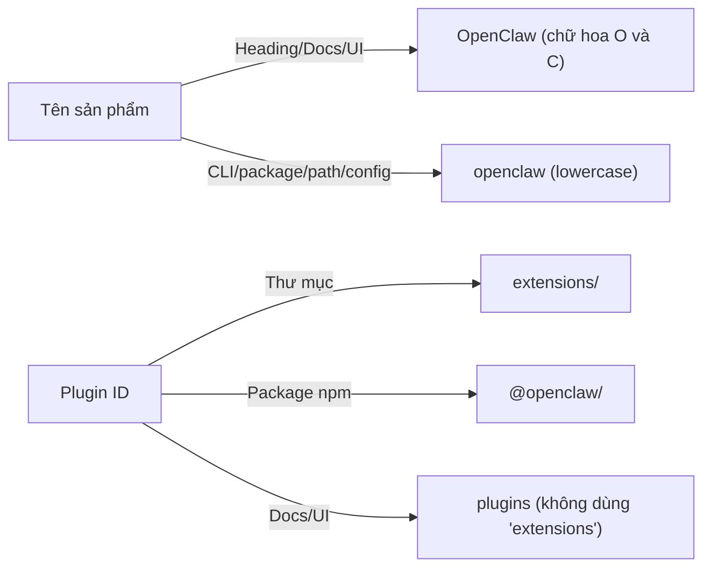
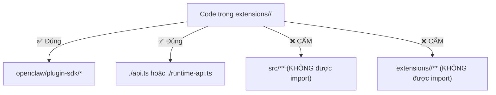
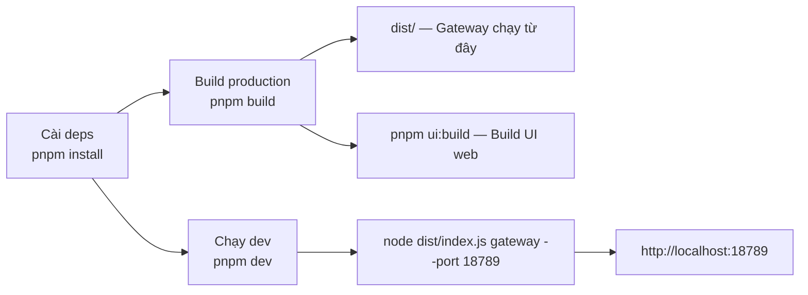
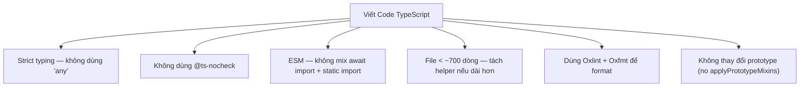
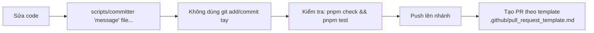
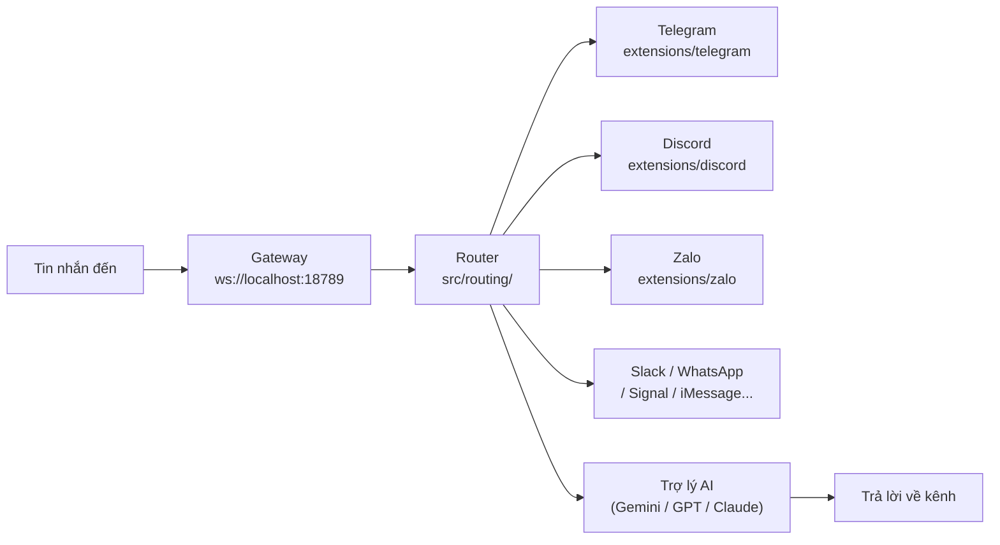
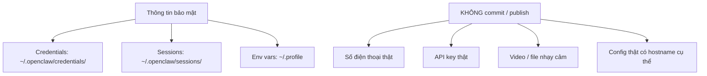
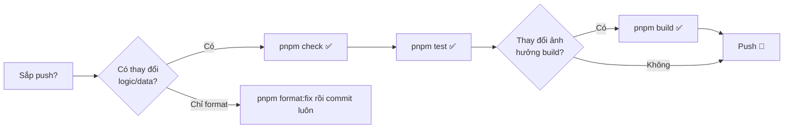

# 🦞 Hướng Dẫn Dự Án irukaclaw — Dành Cho AI Agent & Developer

> Đây là bản Việt hoá của `AGENTS.md` (quy tắc kho mã nguồn).
> File gốc `AGENTS.md` bằng tiếng Anh được giữ nguyên để AI tools đọc đúng.

---

## 1. Cấu Trúc Thư Mục Tổng Quan

```mermaid
graph TD
    ROOT["irukaclaw/"] --> SRC["src/ — Mã lõi TypeScript"]
    ROOT --> EXT["extensions/ — Các plugin kênh"]
    ROOT --> UI["ui/ — Giao diện web Dashboard"]
    ROOT --> DIST["dist/ — File đã build, chạy gateway"]
    ROOT --> DOCS["docs/ — Tài liệu tiếng Anh"]
    ROOT --> HUONG["huong-dan/ — Tài liệu tiếng Việt"]
    ROOT --> SCRIPTS["scripts/ — Build & Dev scripts"]
    ROOT --> PKG["packages/ — Thư viện nội bộ"]
    ROOT --> SKILLS["skills/ — Kỹ năng mở rộng"]

    SRC --> SRC1["src/cli — Wiring CLI"]
    SRC --> SRC2["src/commands — Lệnh CLI"]
    SRC --> SRC3["src/infra — Hạ tầng"]
    SRC --> SRC4["src/media — Pipeline media"]
    SRC --> SRC5["src/provider-web.ts — Web provider"]

    EXT --> EXT1["extensions/telegram"]
    EXT --> EXT2["extensions/discord"]
    EXT --> EXT3["extensions/zalo"]
    EXT --> EXTN["extensions/... (82 kênh)"]
```

---

## 2. Quy Tắc Đặt Tên

---

## 3. Biên Giới Import — Plugin / Extension

---

## 4. Luồng Build & Phát Triển

### Lệnh thường dùng

| Lệnh              | Chức năng                            |
| ----------------- | ------------------------------------ |
| `pnpm install`    | Cài dependencies                     |
| `pnpm dev`        | Chạy Gateway ở chế độ dev            |
| `pnpm build`      | Build toàn bộ (Gateway + Plugin SDK) |
| `pnpm ui:build`   | Build giao diện web Dashboard        |
| `pnpm check`      | Kiểm tra lint + format + type        |
| `pnpm test`       | Chạy toàn bộ test                    |
| `pnpm format:fix` | Tự sửa format code                   |

---

## 5. Quy Tắc Coding

---

## 6. Quy Trình Commit & PR

**Quy tắc commit quan trọng:**

- Không merge commit trên `main` — chỉ rebase
- Không switch branch khi chưa được yêu cầu
- Không chạy `git stash` tự ý

---

## 7. Luồng Channels (Kênh Giao Tiếp)

---

## 8. Quy Tắc Tài Liệu (Docs)

| Quy tắc              | Chi tiết                                                     |
| -------------------- | ------------------------------------------------------------ |
| **Link nội bộ**      | Root-relative, không có `.md` VD: `[Config](/configuration)` |
| **Thứ tự danh sách** | Sắp xếp theo alphabet (trừ khi mô tả thứ tự runtime)         |
| **Heading**          | Không dùng em dash (—) hay apostrophe trong heading          |
| **Link công khai**   | Dùng `https://docs.openclaw.ai/...` (không root-relative)    |
| **Placeholder**      | Dùng `user@gateway-host` thay vì tên máy thật                |

---

## 9. Bảo Mật

---

## 10. Kiểm Tra Nhanh Trước Khi Push

---

> 📌 **Ghi nhớ:** File `AGENTS.md` gốc (tiếng Anh) được giữ nguyên để AI agent đọc đúng quy tắc.
> File này (`agents-vi.md`) chỉ dùng để tham khảo và đọc hiểu nhanh.
