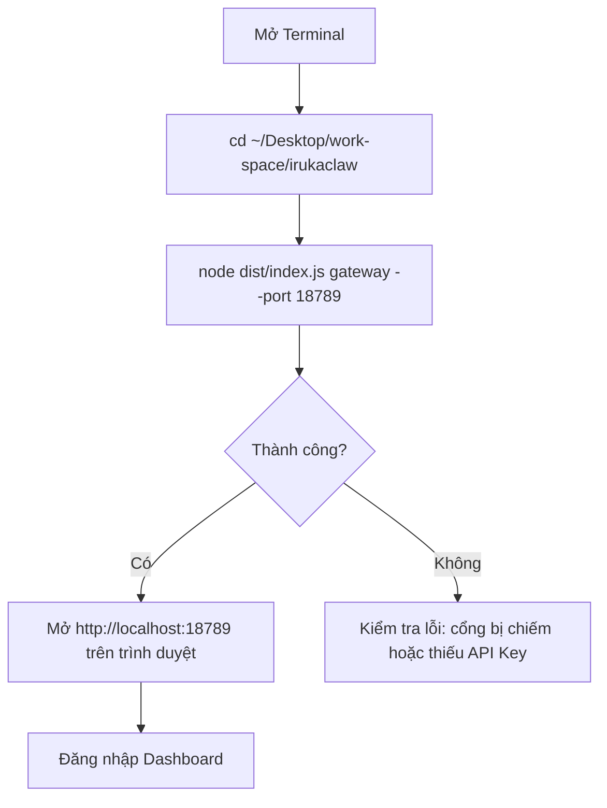
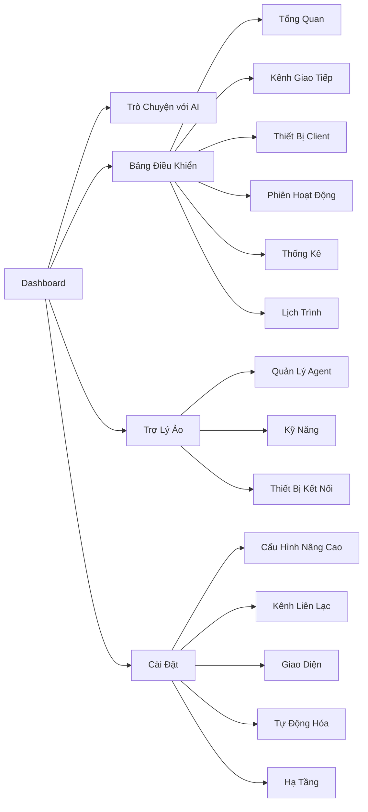
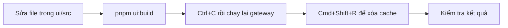
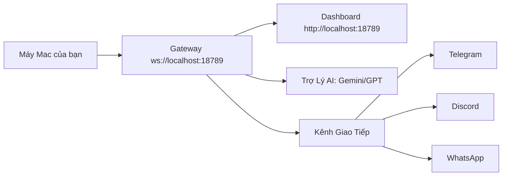

# 🦞 Hướng Dẫn Sử Dụng OpenClaw (Nội Bộ)

> **Phiên bản**: `v2026.3.24` (bản source) · **Ngôn ngữ**: Tiếng Việt · **Cập nhật**: 2026-03-24

---

## 1. OpenClaw Là Gì?

**OpenClaw** là **Trợ Lý AI cá nhân chạy trên máy của bạn** (local-first). Không phụ thuộc vào server bên ngoài — bạn toàn quyền kiểm soát.

```
┌──────────────────────────────────────────────┐
│                  BẠN                        │
│         (máy Mac nội bộ công ty)            │
│                                              │
│  ┌────────────────────────────────────────┐  │
│  │           Gateway Server               │  │
│  │       ws://127.0.0.1:18789             │  │
│  │  (trung tâm điều phối mọi kết nối)     │  │
│  └───────────────┬────────────────────────┘  │
│                  │                           │
│      ┌───────────┼──────────────┐            │
│      │           │              │            │
│  Dashboard   Trợ Lý AI    Kênh Chat          │
│  (Web UI)  (Gemini/GPT)  (Telegram/Discord)  │
└──────────────────────────────────────────────┘
```

### Tính năng chính:

| Tính năng                | Mô tả                                                 |
| ------------------------ | ----------------------------------------------------- |
| 🤖**Trợ Lý AI**          | Hỗ trợ Gemini, ChatGPT, Claude, OpenRouter...         |
| 📡**20+ Kênh Chat**      | Telegram, Discord, WhatsApp, Slack, Zalo, iMessage... |
| 🌐**Dashboard Web**      | Giao diện quản lý tại `http://localhost:18789`        |
| ⏰**Lịch Trình Tự Động** | Cron jobs — gửi tin/chạy lệnh theo lịch               |
| 🔧**Kỹ Năng Mở Rộng**    | Skills — tích hợp thêm công cụ theo nhu cầu           |
| 🔒**Bảo Mật**            | Chạy local, dữ liệu không ra ngoài trừ khi gọi AI     |

---

## 2. Cấu Trúc Thư Mục Dự Án

```
irukaclaw/
├── .env                    ← ⚙️ Cấu hình chính (API keys, token)
├── openclaw.json           ← ⚙️ Config nâng cao (~/.openclaw/openclaw.json)
├── dist/                   ← 🚀 File chạy được (gateway đã build)
│   └── index.js            ← Điểm khởi động gateway
├── ui/                     ← 🎨 Source code giao diện web
│   └── src/i18n/locales/   ← File ngôn ngữ (vi.ts = tiếng Việt)
├── docs/                   ← 📚 Tài liệu gốc (tiếng Anh)
├── skills/                 ← 🔧 Kỹ năng mở rộng
├── huong-dan/              ← 📖 Tài liệu nội bộ (thư mục này)
└── packages/               ← Thư viện nội bộ
```

---

## 3. Cấu Hình Hệ Thống (`.env`)

File `.env` nằm ở thư mục gốc — chứa các thông tin bí mật quan trọng:

```bash
# ---- Xác thực Gateway ----
OPENCLAW_GATEWAY_TOKEN=<token-dài-ngẫu-nhiên>

# ---- API Key AI (phải có ít nhất 1) ----
GEMINI_API_KEY=...         # Google Gemini
OPENAI_API_KEY=sk-...      # ChatGPT
ANTHROPIC_API_KEY=sk-ant-  # Claude

# ---- Kênh Chat (cài kênh nào thì điền kênh đó) ----
TELEGRAM_BOT_TOKEN=...
DISCORD_BOT_TOKEN=...
SLACK_BOT_TOKEN=xoxb-...
```

> ⚠️ **Quan trọng**: Không commit file `.env` lên Git. File này đã có trong `.gitignore`.

---

## 4. Khởi Động Gateway



### Lệnh khởi động:

```bash
cd ~/Desktop/work-space/irukaclaw
node dist/index.js gateway --port 18789
```

### Dừng gateway:

```
Nhấn Ctrl+C trong terminal đang chạy gateway
```

---

## 5. Đăng Nhập Dashboard

1. Mở trình duyệt → vào **`http://localhost:18789`**
2. Điền thông tin đăng nhập:

| Trường            | Giá trị                                            |
| ----------------- | -------------------------------------------------- |
| **WebSocket URL** | `ws://localhost:18789`                             |
| **Gateway Token** | Giá trị `OPENCLAW_GATEWAY_TOKEN` trong file `.env` |
| **Password**      | Để trống                                           |

3. Nhấn **Kết nối** → Dashboard sẽ hiển thị bằng tiếng Việt

---

## 6. Các Màn Hình Chính



---

## 7. Các Lệnh Chat Nhanh

Gửi các lệnh này trực tiếp trong cửa sổ chat (Telegram/Discord/Dashboard):

| Lệnh                     | Chức năng                                        |
| ------------------------ | ------------------------------------------------ |
| `/status`                | Xem trạng thái: model đang dùng, token đã tiêu   |
| `/new` hoặc `/reset`     | Xóa lịch sử, bắt đầu cuộc trò chuyện mới         |
| `/compact`               | Tóm tắt và thu gọn ngữ cảnh hiện tại             |
| `/think <mức>`           | Điều chỉnh mức tư duy: off/low/medium/high/xhigh |
| `/verbose on/off`        | Bật/tắt chế độ chi tiết                          |
| `/usage off/tokens/full` | Hiển thị lượng token đã dùng sau mỗi tin         |
| `/restart`               | Khởi động lại gateway (chỉ chủ nhóm)             |

---

## 8. Kênh Chat Hỗ Trợ

OpenClaw hỗ trợ kết nối với **20+ kênh nhắn tin**:

| Kênh         | Cấu hình cần thiết                      |
| ------------ | --------------------------------------- |
| **Telegram** | `TELEGRAM_BOT_TOKEN` trong `.env`       |
| **Discord**  | `DISCORD_BOT_TOKEN` trong `.env`        |
| **Slack**    | `SLACK_BOT_TOKEN` + `SLACK_APP_TOKEN`   |
| **WhatsApp** | Cấu hình qua Dashboard → Kênh Giao Tiếp |
| **Zalo**     | `ZALO_BOT_TOKEN` trong `.env`           |
| **iMessage** | Cài qua BlueBubbles (macOS)             |
| **WebChat**  | Tích hợp sẵn — dùng ngay tại Dashboard  |

---

## 9. Lịch Trình Tự Động (Cron Jobs)

Tạo các tác vụ chạy định kỳ mà không cần bạn thao tác:

1. Vào **Bảng Điều Khiển → Lịch Trình**
2. Nhấn **+ Tạo mới**
3. Điền:
   - **Tên job**: ví dụ `Báo cáo sáng`
   - **Biểu thức Cron**: ví dụ `0 8 * * *` (chạy lúc 8:00 mỗi ngày)
   - **Nội dung**: tin nhắn hoặc lệnh cần thực hiện

---

## 10. Cập Nhật Giao Diện (Khi Sửa Code UI)



```bash
# Bước 1: Build UI (chạy trong Terminal bên ngoài VS Code)
cd ~/Desktop/work-space/irukaclaw
pnpm ui:build

# Bước 2: Restart gateway
node dist/index.js gateway --port 18789
```

---

## 11. Xử Lý Sự Cố

| Vấn đề                       | Nguyên nhân                   | Cách khắc phục                    |
| ---------------------------- | ----------------------------- | --------------------------------- |
| Không vào được dashboard     | Gateway chưa chạy             | Chạy lệnh khởi động ở mục 4       |
| Giao diện hiển thị tiếng Anh | Cache trình duyệt cũ          | `Cmd+Shift+R` hoặc mở tab ẩn danh |
| Lỗi EPERM khi build          | Chạy pnpm từ VS Code terminal | Dùng Terminal.app hoặc iTerm2     |
| Cổng 18789 đã bị chiếm       | Có gateway cũ đang chạy       | `lsof -ti:18789 \| xargs kill`    |
| AI không phản hồi            | Thiếu hoặc sai API Key        | Kiểm tra file `.env`              |
| Bot Telegram không phản hồi  | Sai Token hoặc chưa kết nối   | Kiểm tra `TELEGRAM_BOT_TOKEN`     |

---

## 12. Kiến Trúc Hệ Thống



## 13. Thông Tin Kỹ Thuật (Tham Khảo)

| Mục                  | Giá trị                             |
| -------------------- | ----------------------------------- |
| Gateway URL          | `ws://localhost:18789`              |
| Dashboard URL        | `http://localhost:18789`            |
| Config file          | `~/.openclaw/openclaw.json`         |
| Log file             | `/tmp/openclaw/openclaw-<ngày>.log` |
| Token (trong `.env`) | `OPENCLAW_GATEWAY_TOKEN`            |
| Mô hình AI đang dùng | `google/gemini-3.1-pro-preview`     |
| Tài liệu gốc         | https://docs.openclaw.ai            |

---

> 📌 **Ghi chú bảo mật**: Toàn bộ dữ liệu và lịch sử chat lưu tại máy bạn (`~/.openclaw/`).
> Kết nối ra ngoài duy nhất là khi gọi API AI (Gemini/ChatGPT/Claude).
