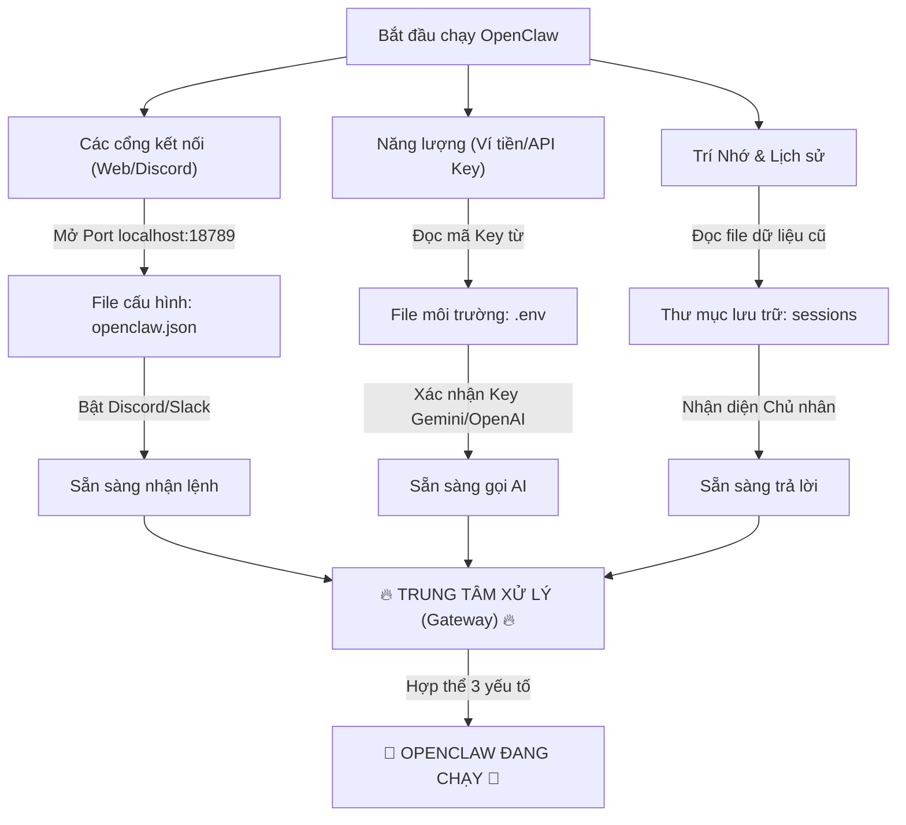
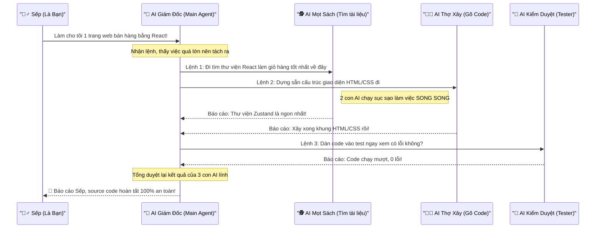

# Sơ đồ Toàn cảnh: Cấu hình, Sử dụng & Sức mạnh của OpenClaw

Tại sao openclaw được sinh ra và nó mạnh như thế nào? Dưới đây là các sơ đồ dễ hiểu nhất để bạn nắm bắt toàn bộ.

---

## 1. Cấu hình OpenClaw thế nào cho đúng? (Sơ đồ cấu hình)

Hệ thống OpenClaw sẽ kiểm tra các thông tin cấu hình từ 3 nơi chính trước khi nó có thể chạy hoàn chỉnh. Bạn chỉ cấu hình 1 lần duy nhất lúc setup.

**Cách nhớ siêu nhanh 3 file quan trọng nhất:**

- File `.env`: Nơi đổ xăng (Khai báo API Key của AI).
- File `openclaw.json`: Chiếc vô lăng (Quyết định nền tảng kết nối, ví dụ bật Discord).
- Lệnh `node dist/index.js gateway`: Chìa khóa đề máy xe (Khởi động hệ thống).

---

## 2. Sức mạnh Khủng bố nhất: Kiến trúc Đa Đặc Vụ (Multi-Agent)

Điểm "ăn tiền" làm nên tên tuổi của OpenClaw so với ChatGPT bình thường là khả năng **tự đẻ ra các con AI khác (Đặc vụ phụ - Sub-agents)** để chia việc ra làm.

**Ví dụ thực tế:** Thay vì con AI chính phải ôm đồm làm 10 việc rồi bị đơ, nó sẽ đóng vai trò **Giám Đốc** và tuyển dụng thêm 3 con AI phục vụ làm lính đánh thuê!

### Tại sao lại cần làm thế này?

- **Để lách luật Token Limit:** Một con AI chỉ nhớ được (ví dụ) 100.000 chữ. Nếu làm 1 dự án khổng lồ, nó sẽ... quên não. Nhưng nếu nó đẻ ra 10 con AI con, mỗi con nhớ 100.000 chữ ở phạm vi của nó thì gộp lại chúng ta có trí nhớ của siêu nhân.
- **Tiết kiệm thời gian (Chạy song song):** Giống hệt 1 team kỹ sư, Agent tìm thông tin trên mạng, Agent tải file, Agent đọc docs... đều chạy cùng lúc.
- **Tự sửa lỗi chéo:** Agent Code viết xong, nó gọi Agent Tester vào chê và tự bắt nhau sửa đến khi đạt thì thôi trước khi báo về cho bạn!

### Sự kết hợp hoàn hảo với "Skills" (Kỹ năng)

OpenClaw cho phép bạn viết các file `SKILL.md`. Nó giống như quyển **"Bí Kíp Võ Công"**.

- Bạn đưa 1 Bí kíp "_Viết API bằng Python FastApi_" cho nó.
- Mỗi khi bạn nhắn _"Làm 1 cái API Game"_ -> OpenClaw sẽ tự động Spawn (gọi) ra 1 con Sub-Agent, ném cho con đó quyển bí kíp Python, và con sub-agent đó sẽ trở thành Thợ Code Python siêu cấp.

=> Trở thành một bộ não trung tâm chuyên điều phối binh lính (Multi-agent architecture). Đó chính là lý do vì sao nó được gọi là **Autonomous Agentic Platform** (Nền tảng Tác nhân AI Tự động)!
